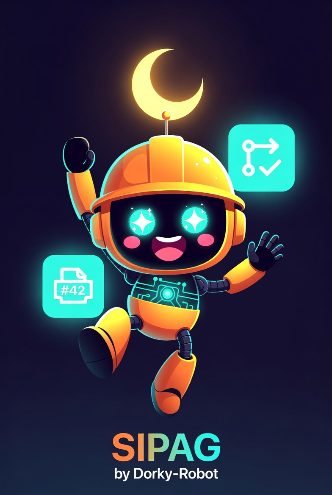

# sipag

[](https://dorkyrobot.com/discord)

<div align="center">



*The OKR layer for an agentic fleet.*

</div>

## What is sipag?

> For the product story (what it feels like, why it exists, the FAQ),
> see [`docs/narrative.md`](docs/narrative.md). This README is install
> + a tactical overview.

sipag is the layer where humans steer an agentic dev fleet via **Objectives
+ Key Results**. Strategic direction lives at the top; agents handle
execution underneath. See [`VISION.md`](VISION.md) for the strategic
principles behind the shape.

Tactically today: sipag owns the project board (tasks, statuses, roles) and
ships work to running terminal sessions managed by
[katulong](https://github.com/Dorky-Robot/katulong). Each task knows which
role it belongs to; dispatching a task tells katulong to launch the role's
command in the right session.

1. **`sipag dispatch <task_id>`** — Sends a task to its role's katulong session
   and moves it to `in-progress`.
2. **`sipag tui`** — Interactive board view across all configured projects.

To set up review agents and slash commands in a project's `.claude/`
directory, use [hulma](https://github.com/Dorky-Robot/hulma).

## Quick start

1. Install sipag:

   ```bash
   brew tap Dorky-Robot/sipag
   brew install sipag
   ```

2. Register a project and add a task:

   ```bash
   sipag project add my-app --repo owner/my-app
   sipag add "Wire up the settings page" --role dev
   ```

3. Dispatch the task to its role's katulong session:

   ```bash
   sipag dispatch 1
   ```

4. Watch the board:

   ```bash
   sipag tui
   ```

## How it works

```
sipag add ...           Title becomes a task on the board
        ↓
sipag dispatch <id>     Sends the task to its role's katulong session
        ↓
katulong session        Agent runs the role's command, picks up the task
        ↓
sipag move <id> review  You move work along as the agent finishes
```

sipag itself does not run code — it is a board and a dispatcher. Long-running
terminal sessions live in katulong; sipag just tells katulong what to do next.

### sipag tui

Running `sipag` with no arguments (or `sipag tui`) opens an interactive
board view. Columns reflect the project's configured statuses; arrow keys
move between cards, and a few hotkeys add/move/dispatch tasks without
leaving the TUI.

## Installation

### Homebrew (macOS and Linux — recommended)

```bash
brew tap Dorky-Robot/sipag
brew install sipag
```

This installs the pre-built binary — no Rust toolchain required.

### One-line install (macOS and Linux)

```bash
curl -fsSL https://raw.githubusercontent.com/Dorky-Robot/sipag/main/scripts/install.sh | sh
```

Supports macOS (Intel and Apple Silicon) and Linux (x86\_64 and ARM64). Installs the binary to `/usr/local/bin/sipag`.

### From source (Rust + Cargo required)

```bash
cargo install --path sipag
```

Or use the Makefile:

```bash
make install
```

This installs `sipag` to `~/.cargo/bin/sipag`.

### Build without installing

```bash
make build
# Binary at: target/release/sipag
```

## Configuration

sipag reads its state from `~/.sipag/` (override with `SIPAG_DIR`):

```
~/.sipag/
├── config.toml                        # default_project, etc.
├── hosts.toml                         # multi-host katulong mesh registration
├── corpus/items.jsonl                 # local vector store for lens-worker observations
├── lenses/<name>.toml                 # lens registry (one file per lens; see extras/lens.toml.example)
├── models.toml                        # optional: Profile → concrete model name per machine
├── pubsub/<topic>/log.jsonl           # file-backed durable broker
├── objectives/<id>/                   # top-level Objectives + their KRs
└── projects/
    └── <project>/
        ├── project.toml               # name, repo, statuses
        ├── tasks/<id>.toml            # one file per task
        ├── roles/<role>.toml          # role templates (command, worktree)
        └── key-results/<NNN>.toml     # KRs scoped to this project
```

Dispatch talks to katulong over HTTP; configure the connection at
`~/.katulong/remote.json`:

```json
{ "url": "https://katulong.example", "apiKey": "..." }
```

The lens scheduler + dispatch gate go through the ollama-bridge
(local queue/auth daemon in front of `ollama serve`); configure at
`~/.ollama-bridge/remote.json`:

```json
{ "url": "https://ollama-bridge.local", "apiKey": "..." }
```

## CLI reference

```
sipag dispatch <TASK_ID>     Dispatch a task to its role's katulong session
sipag up [project]           Spin up sessions for every role in the project
sipag tui                    Launch the interactive board (same as no args)
sipag add <title>            Add a task to the board
sipag list                   List tasks on the board
sipag move <id> <status>     Move a task to a new status
sipag projects               List all projects
sipag project add <name>     Register a project
sipag sub <topic>            Subscribe to a katulong pub/sub topic
sipag serve                  Run the web UI (default port 7100)
                             --workers            enable label-driven autonomous workers
                             --lens-scheduler     enable the lens-worker scheduler (Phase 1 #3)
sipag version                Print version
```

## Part of the dorky robot stack

```
kubo (think)  →  sipag (OKR + dispatch)  →  katulong (sessions)  →  agents
```

- [kubo](https://github.com/Dorky-Robot/kubo) — chain-of-thought reasoning, breaks problems into steps
- [katulong](https://github.com/Dorky-Robot/katulong) — long-running terminal sessions for agents
- [hulma](https://github.com/Dorky-Robot/hulma) — scaffolds review agents and slash commands into a project
- **sipag** — the OKR layer; humans steer here, agents work below

## Development

```bash
# Requirements: Rust toolchain (rustup)
cargo build          # debug build
make build           # release build
make test            # cargo test
make lint            # cargo clippy -D warnings
make fmt             # cargo fmt
make dev             # lint + fmt-check + test
make install-hooks   # one-time: activate pre-commit + pre-push + post-commit/merge hooks
```

### Recommended: install diwa for semantic search

[Diwa](https://github.com/Dorky-Robot/diwa) indexes git history and surfaces
decisions / patterns / learnings extracted from commits + PR descriptions.
It's how we navigate "why did we decide X" without rereading every doc:

```bash
brew install dorky-robot/tap/diwa
diwa init .
diwa search Dorky-Robot/sipag "lens-worker abstraction"
```

The repo's post-commit + post-merge hooks call `diwa enqueue .` to keep
the index fresh. Without diwa installed they're a no-op; install when you
want the index.

## Documentation

Full documentation at [sipag.dev](https://sipag.dev).

## License

Licensed under either of:

- Apache License, Version 2.0 ([LICENSE-APACHE](LICENSE-APACHE))
- MIT license ([LICENSE-MIT](LICENSE-MIT))

at your option.

### Contribution

Unless you explicitly state otherwise, any contribution intentionally
submitted for inclusion in the work by you, as defined in the Apache-2.0
license, shall be dual licensed as above, without any additional terms or
conditions.
